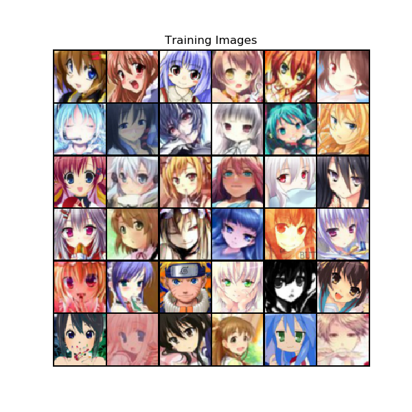
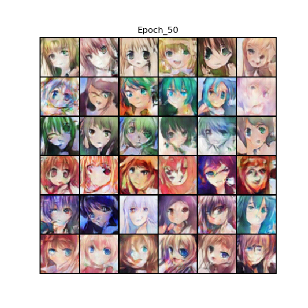

# Conditional AnimeGAN
PyTorch implementation of conditional Generative Adversarial Network (cGAN) for Anime face generation conditioned on eye color and hair color.

<p align="center">

</p>

You can download the dataset from the following [repo](https://github.com/m516825/Conditional-GAN).

## Training
Download the data and place it in the data/ directory. (Optional) Run **`prepro.py`** to clean and preprocess the data. Run **`train.py`** to start training. To change the hyperparameters of the network, update the values in the `param` dictionary insdie `train.py`.
Checkpoints will be saved by default in the `checkpoint` directory every 2 epochs.
By deafult, GPU will be used for training if available. *(Training on CPU is not recommended)*

**Loss Curve**
<p align="center">

</p>
<i>D: Discriminator, G: Generator</i>

## Generating New Images
To generate new images run **`generate.py`**.
```sh
python3 evaluate.py -load_path /path/to/pth/checkpoint -num_output n -eye_color c1 -hair_color c2
```
- Possible colors for eyes
```
['yellow', 'gray', 'blue', 'brown', 'red', 'green', 'purple', 'orange',
 'black', 'aqua', 'pink', 'bicolored']
```
- Possible colors for hair
```
['gray', 'blue', 'brown', 'red', 'blonde', 'green', 'purple', 'orange',
 'black', 'aqua', 'pink', 'white']
```
## Results
<table align='center'>
<tr align='center'>
<td> Training Data </td>
<td> cDCGAN after 50 epochs </td>
</tr>
<tr>
<td>
<td>
</tr>
</table>
Some Generated Samples: <br />
- Blue Eyes Blonde Hair 
- Green Eyes Purple Hair 
- Aqua Eyes Pink Hair 
- Red Eyes Green Hair 
